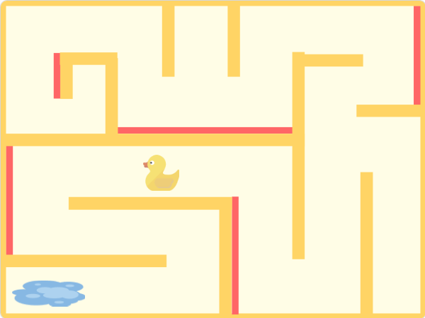

# Duck Maze

A maze game about helping a duck find its way back home.

Originally created on Scratch. Converted to JavaScript with [Leopard](https://leopardjs.com/). Repository created with CodeSandbox.

- [View the project on Scratch](https://scratch.mit.edu/projects/799913073/)
- [View the project on CodeSandbox](https://codesandbox.io/s/github/helenclx/Duck-Maze)

## Instructions:

Bring the duck back to its home at the puddle!

Use the arrow keys or WASD keys to move the duck.
Watch out for red walls!

## Credits:

- Duck sprite: [SVG Repo](https://www.svgrepo.com/)
- Puddle sprite: [publicdomainvectors.org](https://publicdomainvectors.org/)
- Music: Innocence by ROA